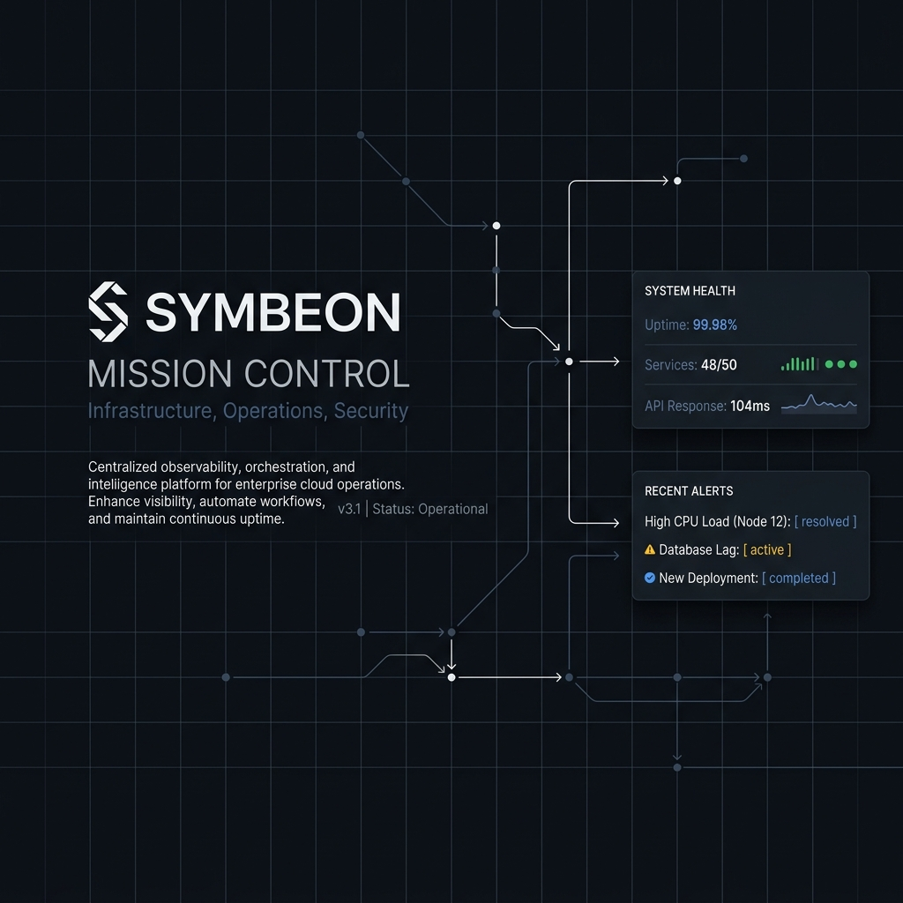
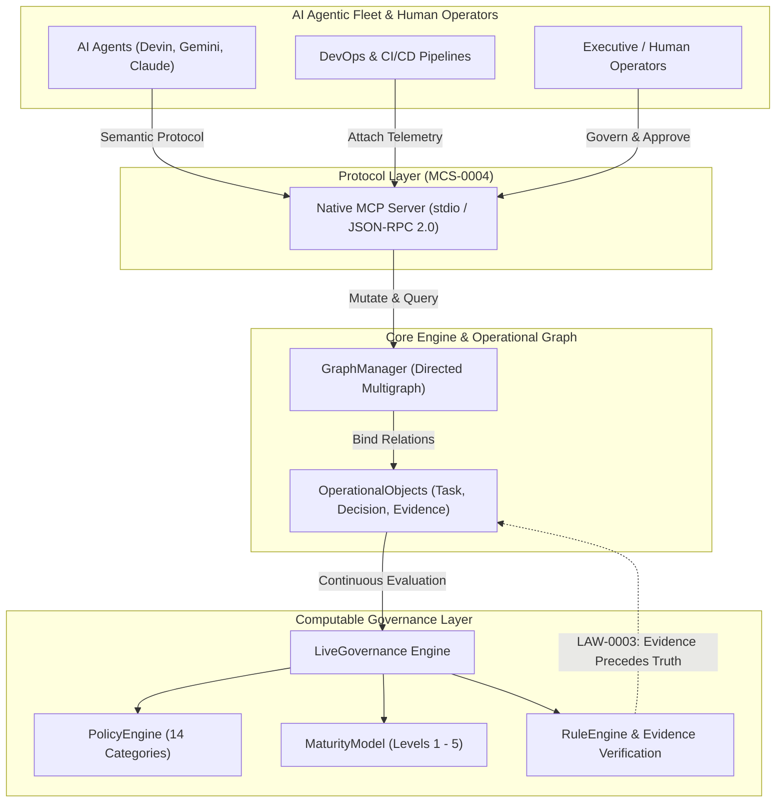

# Symbeon Mission Control

**The Computable Governance Operating System**

> *Transforms operational actions into traceable, graph-driven institutional memory governed by machine-executable policies.*



`computable-governance` • `operational-graph` • `evidence-first` • `alm` • `mcp-server` • `rfc2119` • `agentic-governance` • `symbeon-labs`

📄 **[Read the Executive One-Pager (ONE_PAGE.md)](ONE_PAGE.md)** | 📥 **[Download Executive PDF (Symbeon_Mission_Control_Executive_OnePager.pdf)](docs/pdf/Symbeon_Mission_Control_Executive_OnePager.pdf)** | 📝 **[Read Release v1.0 PR (PULL_REQUEST.md)](PULL_REQUEST.md)**

---

## Mission

Transform every operational action into institutional knowledge.

Every action must become:

**Decision → Evidence → Knowledge → Governance → History → Institutional Asset**

The Mission Control must become the operating system that manages the complete lifecycle of complex technology projects.

**Projects are not collections of tasks. Projects are living operational systems.**

The Mission Control is responsible for documenting their evolution.

---

## Core Principle

**Nothing exists until evidence exists.**

Every operational action must generate at least one evidence object.

**Meeting → Minutes → Decision → Task → Milestone → Document → Release → Historical Record**

If this chain is broken, the system is incomplete.

---

## Information Model

### OperationalObject Base Structure

Every object in the system inherits the same foundation:

```javascript
OperationalObject {
  id
  title
  description
  owner
  project
  status
  version
  created
  updated
  relations
  dependencies
  evidence
  history
  metadata
}
```

All modules extend this base object:
- Task
- Decision
- Evidence
- Document
- Meeting
- Release
- Risk
- Approval
- Milestone
- Stakeholder
- Knowledge

---

## Graph-Based Architecture

Objects do not live isolated. Everything is connected.

**Decision** creates **Task**  
**Task** belongs to **Milestone**  
**Milestone** belongs to **Release**  
**Release** contains **Evidence**  
**Evidence** references **Document**  
**Document** references **Decision**

Every object must display:
- Incoming relations
- Outgoing relations
- Dependency graph
- Historical graph

### System Architecture & Operational Flow



---

## Navigation Structure

Navigation represents how organizations operate, not how databases store data.

- **Mission** - Organizational mission and vision
- **Projects** - Living operational systems
- **Operations** - Day-to-day operational actions
- **Governance** - Decision making and approvals
- **Knowledge** - Captured institutional learning
- **Evidence** - All evidence objects
- **Analytics** - Organizational maturity metrics
- **Administration** - System configuration

---

## Project Health

Dashboard measures organizational maturity, not object counts.

**Indicators:**
- Governance
- Commercial
- Product
- Knowledge
- Evidence
- Documentation
- Execution
- Validation
- Risk

Each indicator is automatically calculated from operational data.

---

## Timeline as Institutional Memory

Timeline is not a log. Timeline is institutional memory.

Every event receives:
- Timestamp
- Actor
- Related Objects
- Evidence
- Impact
- Category

Timeline becomes the history of the company.

---

## Evidence Engine

Evidence is the heart of the platform.

**Evidence Types:**
- Document
- Meeting
- Contract
- Image
- Commit
- Pull Request
- Deployment
- Video
- Presentation
- PDF
- Release

Evidence must always point to operational objects.

---

## Knowledge Engine

Every completed task asks: **What was learned?**

Knowledge becomes searchable.
Knowledge generates templates.
Templates improve future projects.
Projects improve the framework.
The framework improves future projects.

---

## Automatic Reports

Generated directly from operational data:

- Executive Snapshot
- Weekly Report
- Monthly Report
- Baseline Report
- Risk Report
- Governance Report
- Commercial Report
- Knowledge Report
- Deployment Report

---

## Automation

**Creating a Decision automatically suggests:**
- Task
- Milestone
- Timeline Event
- Evidence
- Release

**Creating a Meeting automatically suggests:**
- Minutes
- Decision
- Knowledge
- Evidence

Nothing should require repetitive work.

---

## User Experience

The user should feel like operating a Mission Control, not filling forms.

- Reduce clicks
- Reduce friction
- Increase contextual information
- Show relations instead of lists

---

## Long-Term Goal

The Mission Control must become the operational memory of the organization.

The software should answer instantly:
- Why was this built?
- Who approved it?
- Which decision created it?
- Which evidence proves it?
- Which release delivered it?
- Which project uses it?
- Which knowledge emerged?

---

## Dogfooding

GuardDrive remains Project Zero.

Every improvement made while developing GuardDrive must improve Mission Control itself.

**Mission Control is the product. GuardDrive is its first operational experiment.**

---

## Non-Negotiable Principles

1. **Evidence First** - Nothing exists until evidence exists
2. **Governance by Design** - Governance incorporated from the start
3. **Operational Traceability** - Complete traceability of all actions
4. **Institutional Memory** - Permanent institutional memory
5. **Knowledge as an Asset** - Knowledge treated as institutional asset
6. **Decision Logging** - Systematic decision recording
7. **Graph Relationships** - Everything is connected
8. **Automation First** - Automate repetitive work
9. **Operational Simplicity** - Reduce friction
10. **Long-term Scalability** - Optimize for operational intelligence

---

## The Mission Control is not software.

**It is the computational representation of how an organization learns, decides, builds and evolves.**

## 📜 Normative Specification Ecosystem (MCS Suite)

| Document | Title | Description |
| :--- | :--- | :--- |
| **[MCS-0000](specifications/MCS-0000.md)** | Mission Control Manifesto | The 5 Fundamental Axioms of Computable Reality. |
| **[MCS-0001](specifications/MCS-0001.md)** | Architecture Specification | Layered Architecture & Chapter 0 (10 Irrevocable Architectural Laws). |
| **[MCS-0002](specifications/MCS-0002.md)** | Computational Ontology | Formal Entity, Relation, and Event Taxonomies. |
| **[MCS-0003](specifications/MCS-0003.md)** | Operational State Machine | Formal Lifecycle (`Draft` → `Approved` → `Completed` → `Archived`). |
| **[MCS-0004](specifications/MCS-0004.md)** | Mission Control Protocol | Semantic Operations Protocol for AI Agents and Systems. |
| **[MCS-0005](specifications/MCS-0005.md)** | Evidence Specification | $EvidenceScore$ Formula, Trust Model, and Chain of Custody. |
| **[MCS-0006](specifications/MCS-0006.md)** | Knowledge Specification | Epistemic Evolution Pipeline (`Observation` → `Policy` → `Law`). |
| **[MCS-0007](specifications/MCS-0007.md)** | Operational Graph Specification | Multi-graph semantics, traversal algorithms, and impact cascades. |
| **[MCS-0008](specifications/MCS-0008.md)** | Governance Specification | Mathematical Formulations for $GovernanceScore$ and Maturity Model. |
| **[MCS-0009](specifications/MCS-0009.md)** | Agent Specification | AI Agent Governance (*Agents Observe, Humans Govern*) & `ReasoningChain`. |
| **[MCS-0010](specifications/MCS-0010.md)** | Extension SDK Specification | Hooks, Event Listeners, and External Evidence Adapters. |
| **[MCS-1000](specifications/MCS-1000.md)** | Computational Organization Theory | Scientific Foundation Paper. |
| **[RFC-0000](rfcs/RFC-0000.md)** | Symbeon RFC Process | Formal RFC Lifecycle for Ecosystem Evolution. |

---

## Roadmap & Status

✅ **Phase 1: Foundation** - Basic static UI, project storage, and JSON flat loading.
✅ **Phase 2: Architectural Evolution** - Implementation of `OperationalObject` base class for strict data consistency.
✅ **Phase 3: Operational Graph Engine** - Implementation of `GraphManager` for relationship indexing, dependency traversal, and impact analysis.
✅ **Phase 4: Computable Governance** - Implementation of `PolicyEngine`, continuous compliance scoring, Maturity Model, and the `LiveGovernance` dashboard widget.
✅ **Phase 5: Agentic Hub & MCP** - Built native Model Context Protocol (MCP) Server in `mcp-server/index.js` implementing `MCS-0004` semantic operations for AI agents.
🚧 **Phase 6: External Integrations & Deep Analytics** - Automatic hooks to GitHub/Jira to create evidence objects on commits/PRs, and deep graph visualization rendering.
