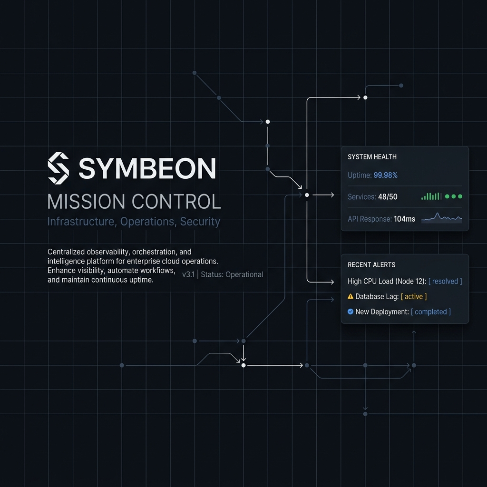

# Symbeon Mission Control

**Making Organizations Computable.**

> *A reference implementation for the Mission Control Specification (MCS).*



`reference-implementation` • `computable-organization` • `operational-graph` • `evidence-first` • `agentic-governance` • `symbeon-labs`

---

## What this is

**Symbeon Mission Control** is a research and engineering implementation of the ideas defined in the **Mission Control Specification (MCS)**.

It explores how an organization can represent operational objects, decisions, evidence, dependencies, governance, knowledge, and history as one connected operational system.

The central idea is:

**Decision → Evidence → Knowledge → Governance → History → Institutional Memory**

Projects are treated as living operational systems rather than isolated lists of tasks.

---

## Core principle

> **Operational state should be traceable to evidence.**

Mission Control is designed so that important actions and decisions can be connected to the evidence, relationships, history, and knowledge surrounding them.

This is a design goal, not a claim that every system state is automatically true or complete.

---

## Information model

The system uses a shared operational-object foundation:

```javascript
OperationalObject {
  id
  title
  description
  owner
  project
  status
  version
  created
  updated
  relations
  dependencies
  evidence
  history
  metadata
}
```

Objects can include:

- Task
- Decision
- Evidence
- Document
- Meeting
- Release
- Risk
- Approval
- Milestone
- Stakeholder
- Knowledge

The graph connects these objects so their dependencies, provenance, and history can be inspected together.

---

## Architecture

At a high level:

```text
Human Operators + AI Agents + Operational Systems
                    ↓
             MCS / MCP boundary
                    ↓
          Operational Graph + Objects
                    ↓
        Evidence + Governance + Knowledge
                    ↓
             Institutional Memory
```

The implementation investigates how agentic systems can operate against structured organizational state without removing explicit governance boundaries.

---

## Operational flow

A typical lifecycle can connect:

**Meeting → Decision → Task → Milestone → Release → Evidence → Historical Record**

The exact flow depends on the operation being represented.

The purpose is to reduce fragmented operational memory and make important relationships inspectable.

---

## Evidence

Evidence is a first-class object.

Possible evidence sources include:

- documents
- meetings
- contracts
- images
- commits
- pull requests
- deployments
- videos
- presentations
- PDFs
- releases

The system records relationships between evidence and operational objects so that decisions and actions can be investigated later.

---

## Knowledge and institutional memory

Completed work can produce explicit knowledge.

That knowledge can become:

- searchable institutional memory
- reusable templates
- operating rules
- future decision context
- evidence for subsequent interventions

The intended feedback loop is:

**Operation → Evidence → Knowledge → Future Operation**

---

## Reference to MCS

The implementation is developed alongside the open MCS specification:

**[Mission Control Specification](https://github.com/symbeon-labs/mission-control-specification)**

MCS defines the conceptual and normative layer.

Mission Control provides an executable implementation surface through which those ideas can be tested.

---

## Current status

**Research / reference implementation — evolving.**

The repository is not presented as a finished enterprise operating system or universal governance solution.

Its value is in making the computational model executable, testable, inspectable, and subject to evidence from real operational use.

Current development areas include:

- operational graph
- evidence and provenance
- governance mechanisms
- knowledge capture
- agent interfaces
- automation
- reporting
- interoperability

---

## Relationship to Symbeon Labs

Mission Control is one technical expression of Symbeon's broader research into **Computable Organizations**.

The institutional method is:

**Observe → Map → Evidence → Model → Intervene → Measure → Learn**

The implementation is expected to evolve as operational evidence and research findings accumulate.

---

## What this is not

Mission Control is not:

- a claim that all organizational reality can be fully automated
- a replacement for every ERP or enterprise system
- a guarantee of truth from AI output
- a finished universal standard by itself
- a substitute for human governance

---

## Research principle

> **Evidence before intervention.**

The system should make it possible to understand what happened, why it happened, what evidence supports it, and what was learned.

---

**Symbeon Labs**  
*Applied Research for Computable Organizations.*
